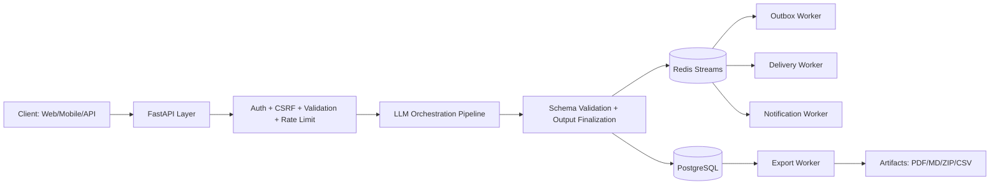

# SystemForge AI

SystemForge AI is a full-stack AI Engineering Workspace that transforms product requirements into production-ready system design artifacts.

It is built with an artifact-first approach (instead of a generic chatbot flow): generation, review, versioning, security, export, and delivery workflows are integrated in one platform.

Repository: [github.com/ardamoustafa1/SystemForge-AI](https://github.com/ardamoustafa1/SystemForge-AI)
Turkish version: [README.md](README.md)


## Overview

- AI-powered system design generation with strict schema validation
- Review workflow (`draft`, `in_review`, `approved`, `changes_requested`)
- Version history, compare/explain flows, and comments
- Export formats: Markdown, PDF, scaffold ZIP, Terraform ZIP, tasks CSV
- Workspace-first authorization with roles and budget controls
- Realtime messaging via WebSocket + Redis Streams
- Multi-worker backend topology for generation/export/delivery

## Architecture Snapshot



## Tech Stack

### Frontend
- Next.js 15, React 19, TypeScript
- Tailwind CSS
- SWR
- React Hook Form + Zod
- Mermaid, XYFlow
- Vitest, Playwright

### Backend
- FastAPI, SQLAlchemy, Pydantic
- PostgreSQL, Redis
- Alembic
- Sentry SDK
- Pytest, pytest-asyncio

### Infrastructure
- Docker Compose
- Multi-service worker architecture
- GitHub Actions CI

## Services (Docker Compose)

- `postgres`
- `redis`
- `backend`
- `backend-migrate`
- `backend-generation-worker`
- `backend-export-worker`
- `backend-outbox-worker`
- `backend-delivery-worker`
- `backend-notification-worker`
- `backend-test`
- `frontend`

## Quick Start

```bash
cp .env.example .env
docker compose up --build
```

Then open:
- Frontend: [http://localhost:3000](http://localhost:3000)
- API docs: [http://localhost:8000/docs](http://localhost:8000/docs)
- Health: [http://localhost:8000/api/health](http://localhost:8000/api/health)

## Local Development

Backend:

```bash
cd backend
python3 -m venv .venv
source .venv/bin/activate
pip install -r requirements.txt
cp .env.example .env
alembic upgrade head
uvicorn app.main:app --reload
```

Frontend:

```bash
cd frontend
npm install
cp .env.example .env.local
npm run dev
```

## API Surface (High-Level)

Main endpoint groups:
- `/api/auth/*`
- `/api/designs/*`
- `/api/workspaces/*`
- `/api/security/*`
- `/api/dashboard/*`
- `/api/health*`
- `/api/ws`

For the full endpoint list, see `README.md`.

## Environment Variables

Core variables:
- `DATABASE_URL`, `REDIS_URL`
- `JWT_SECRET`, `JWT_ALGORITHM`
- `OPENAI_API_KEY`, `OPENAI_MODEL`, `OPENAI_BASE_URL`
- `NEXT_PUBLIC_API_URL`, `NEXT_PUBLIC_APP_NAME`
- `PUBLIC_APP_URL`

For the complete variable matrix, see `README.md` -> "Full Environment Variables Reference".

## Operations Quick Commands

```bash
make up
make down
make logs
docker compose ps
```

Health checks:

```bash
curl -s http://localhost:8000/api/health
curl -s http://localhost:8000/api/health/ready
```

## Security Notes

- Use strong `JWT_SECRET` in production
- Keep `AUTO_CREATE_TABLES=false` outside local development
- Restrict `CORS_ORIGINS` to trusted origins
- Run with HTTPS and `COOKIE_SECURE=true`

See: [SECURITY.md](SECURITY.md)

## Documentation Map

- [Case Study](docs/CASE_STUDY.md)
- [Threat Model](docs/THREAT_MODEL.md)
- [Security Posture](docs/SECURITY_POSTURE.md)
- [API Governance Playbook](docs/API_CONTRACT_GOVERNANCE_PLAYBOOK.md)
- [Load Test Report](docs/LOAD_TEST_REPORT.md)

## Contribution and Release Docs

- [Contributing Guide](CONTRIBUTING.md)
- [Changelog](CHANGELOG.md)
- [ADR-001 Workspace-First Authz](docs/ADR-001-workspace-first-authz.md)

## License

No license file is currently included. Add a `LICENSE` file to define usage terms.
