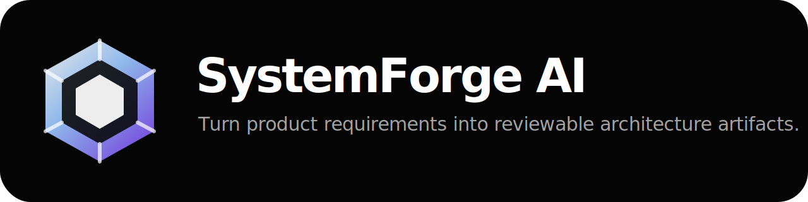
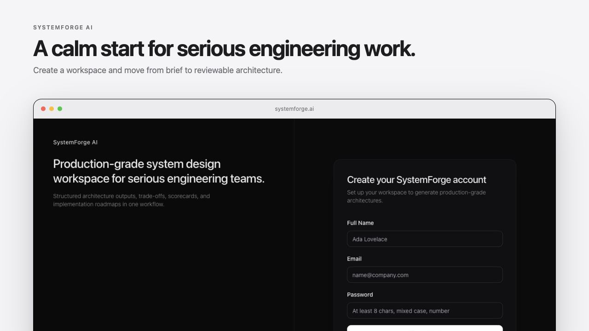
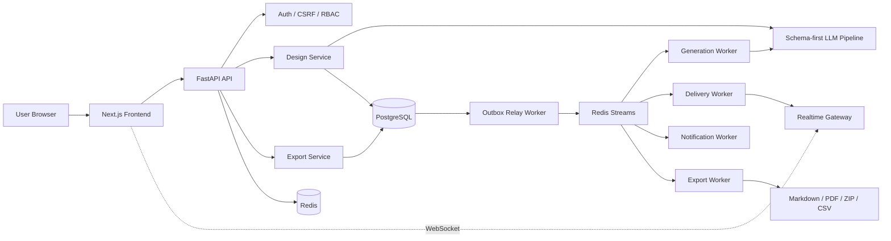

# SystemForge AI



**Turn raw product requirements into structured, reviewable, exportable architecture artifacts.**

SystemForge AI is an artifact-first architecture assistant for teams that want more than a chatbot transcript. Give it a product brief; it produces a schema-validated architecture package with executive summary, runtime topology, database design, security model, cost notes, implementation checklist, Mermaid diagrams, review workflow, and exports.

[](https://github.com/ardamoustafa1/SystemForge-AI/actions/workflows/ci.yml)
[](https://github.com/ardamoustafa1/SystemForge-AI/actions/workflows/codeql.yml)
[](https://github.com/ardamoustafa1/SystemForge-AI/discussions)


> Status: production-oriented open-source project. The architecture, demo flow, tests, release docs, and ops assets are being hardened toward a stable public release. See [Release Process](docs/RELEASE_PROCESS.md) and [Production Checklist](ops/PRODUCTION_CHECKLIST.md).

## Why this exists

Teams already use AI to think through systems. The problem is that the output usually stays trapped in chat: hard to review, hard to version, hard to export, and hard to turn into engineering work.

SystemForge AI turns that flow into a product:

- **Brief → architecture artifact**, not brief → endless chat.
- **Strict schemas** so generated output has a predictable shape.
- **Review states and comments** so architecture can move from draft to approval.
- **Realtime worker architecture** for generation, export, notification, and delivery events.
- **Exports** for Markdown, PDF, scaffold ZIP, Terraform ZIP, and task CSV workflows.
- **Local demo seed data** so visitors can understand the product in minutes.

## Product tour

<p align="center">
  
</p>

<table>
  <tr>
    <td width="50%">
      
    </td>
    <td width="50%">
      
    </td>
  </tr>
  <tr>
    <td colspan="2">
      
    </td>
  </tr>
</table>

## 🌟 Live Demo & Community

- **Live Demo**: [https://demo.systemforge.dev](https://demo.systemforge.dev)
- **Community Discussions**: [Join GitHub Discussions](https://github.com/ardamoustafa1/SystemForge-AI/discussions)
- **Support the project**: [💖 Sponsor on GitHub](https://github.com/sponsors/ardamoustafa1)

## 3-minute local demo

```bash
git clone https://github.com/ardamoustafa1/SystemForge-AI.git
cd SystemForge-AI
cp .env.example .env
docker compose up --build
```

Open:

- Web app: http://localhost:3000
- API docs: http://localhost:8000/docs
- Health: http://localhost:8000/api/health

Demo account seeded by Docker Compose:

```text
Email: demo@systemforge.dev
Password: SystemForgeDemo123!
```

The idempotent demo seed job creates three showcase designs:

1. **Multi-tenant SaaS Control Plane**
2. **Marketplace Order & Fulfillment Platform**
3. **AI Workflow Automation Hub**

An OpenAI key is optional for local exploration. If no model key is configured, the deterministic fallback generator still creates schema-valid demo artifacts.

Full walkthrough: [docs/DEMO_SCRIPT.md](docs/DEMO_SCRIPT.md)

## What SystemForge generates

For each design brief, SystemForge can produce:

- Executive summary
- Functional and non-functional requirements
- Runtime topology
- Data flow and persistence plan
- Database entity/indexing/migration notes
- WebSocket/realtime strategy
- AI orchestration/fallback strategy
- Security architecture
- Observability and SLO notes
- Cost considerations
- Trade-off decisions
- Implementation roadmap
- Engineering checklist
- Mermaid architecture diagram
- Export-ready Markdown/PDF artifact

## Architecture



Deep dive: [docs/ARCHITECTURE.md](docs/ARCHITECTURE.md)

## Tech stack

| Area | Stack |
|---|---|
| Frontend | Next.js App Router, React, TypeScript, Tailwind, SWR, Zod, Mermaid |
| Backend | FastAPI, SQLAlchemy, Pydantic, Alembic |
| Data | PostgreSQL, Redis, Redis Streams |
| Realtime | WebSocket gateway, outbox relay, delivery worker |
| Workers | generation, export, outbox, delivery, notification |
| Ops | Docker Compose, Helm, Kubernetes manifests, Grafana dashboard, alert rules, runbooks |
| QA | Pytest, Vitest, Playwright, k6 scenario, GitHub Actions |

## Repository map

```text
.
├─ frontend/                 # Next.js app, UI components, tests, Playwright
├─ backend/                  # FastAPI app, services, schemas, workers, migrations
├─ docs/                     # Architecture, security, governance, demo, showcase docs
├─ ops/                      # Helm, K8s, alerts, Grafana, runbooks, load tests
├─ .github/                  # CI, release, security, templates
├─ docker-compose.yml        # Local full-stack demo
├─ CHANGELOG.md
├─ CONTRIBUTING.md
├─ SECURITY.md
└─ README.md
```

## Showcase examples

Read the product examples here: [docs/SHOWCASE_EXAMPLES.md](docs/SHOWCASE_EXAMPLES.md)

Browse the concrete export files: [examples/README.md](examples/README.md)

Current showcase set:

- **[SaaS architecture export](examples/saas-control-plane/architecture.md)**: workspace-first B2B control plane.
- **[Marketplace Docker export](examples/marketplace-platform/docker-compose.yml)**: idempotent checkout, seller inventory, fulfillment events.
- **[AI workflow Terraform/Kubernetes export](examples/ai-workflow-hub/)**: provider fallback, queue backpressure, and autoscaling.

## Benchmark and load testing

k6 scenario:

```bash
BASE_URL=http://localhost:8000/api \
AUTH_COOKIE='...' \
CSRF='...' \
WORKSPACE_ID='1' \
k6 run ops/load-tests/k6-systemforge.js
```

Benchmark plan and report:

- [docs/BENCHMARK_PLAN.md](docs/BENCHMARK_PLAN.md)
- [docs/LOAD_TEST_REPORT.md](docs/LOAD_TEST_REPORT.md)

Performance numbers should be treated as release evidence only after the environment, dataset, commit SHA, RPS, p95, error rate, and hardware profile are recorded in the report.

Latest measured local smoke result (`GET /api/health`, up to 100 configured VUs): **56.01 req/s average, 14.68 ms p95, 0.00% errors**. This is HTTP-stack smoke evidence, not a generation/export capacity claim.

## Local development

Backend:

```bash
cd backend
python3 -m venv .venv
source .venv/bin/activate
pip install -e ".[dev]"
alembic upgrade head
uvicorn app.main:app --reload
```

Frontend:

```bash
cd frontend
npm ci
npm run dev
```

Quality checks:

```bash
ruff check backend/app backend/tests
pytest backend/tests -q

cd frontend
npm run lint
npm run test
npm run build
```

## API surface

Primary endpoint groups:

- `/api/auth/*`
- `/api/workspaces/*`
- `/api/designs/*`
- `/api/designs/{id}/export*`
- `/api/designs/{id}/versions*`
- `/api/public/share/*`
- `/api/dashboard/*`
- `/api/security/*`
- `/api/health*`
- `/api/ws`

Full reference: [docs/API_REFERENCE.md](docs/API_REFERENCE.md)

## Release system

The repository includes:

- Semantic versioning policy
- Changelog
- GitHub release workflow
- Signed GHCR container image workflow
- Helm chart assets
- Source/image SBOM, provenance, and checksums
- Security workflow
- Release checklist

Read: [docs/RELEASE_PROCESS.md](docs/RELEASE_PROCESS.md)

## Contributor experience

- [Contributing Guide](CONTRIBUTING.md)
- [Good First Issues](docs/GOOD_FIRST_ISSUES.md)
- [Maintainer Guide](docs/MAINTAINER_GUIDE.md)
- [Code of Conduct](CODE_OF_CONDUCT.md)
- [Security Policy](SECURITY.md)
- [Roadmap](ROADMAP.md)

If you want to help, the best first contributions are screenshots, docs improvements, focused tests, mobile polish, and small backend validation coverage.

## Security

SystemForge includes production-oriented security boundaries: workspace RBAC, CSRF protection, secure cookie flows, rate limiting, usage quotas, public-share controls, and documented threat modeling.

Security docs:

- [SECURITY.md](SECURITY.md)
- [docs/THREAT_MODEL.md](docs/THREAT_MODEL.md)
- [docs/SECURITY_POSTURE.md](docs/SECURITY_POSTURE.md)
- [ops/PRODUCTION_CHECKLIST.md](ops/PRODUCTION_CHECKLIST.md)

## Roadmap

Near-term focus:

- Make CI fully green from a clean checkout.
- Harden dependency/security scanning.
- Expand E2E coverage across Chromium, Firefox, WebKit, and mobile viewports.
- Publish first signed release artifacts.
- Add real benchmark runs with reproducible environment details.
- Improve export validation for Terraform, Docker, Kubernetes, and task CSV outputs.

## License

MIT — see [LICENSE](LICENSE).
