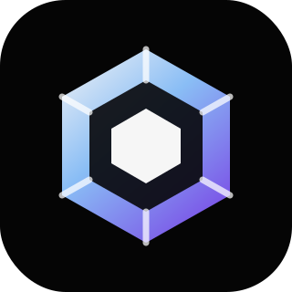
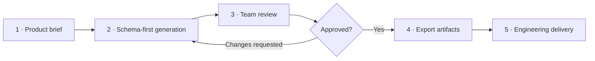
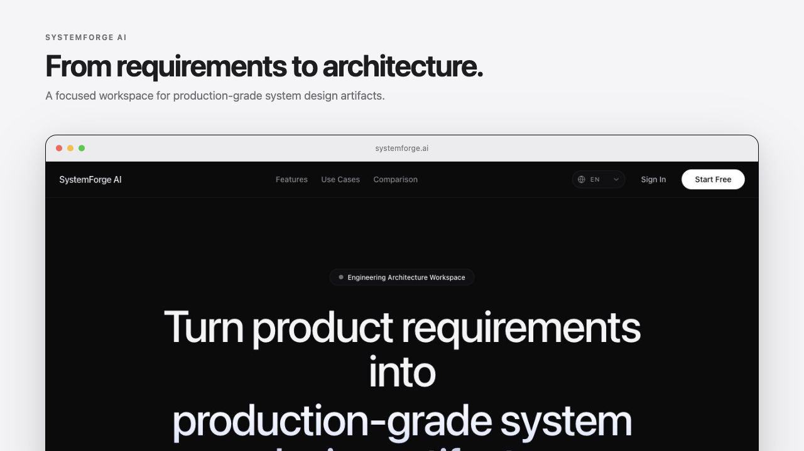
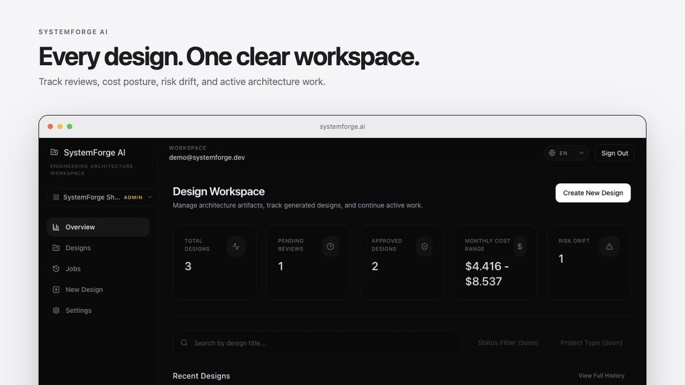
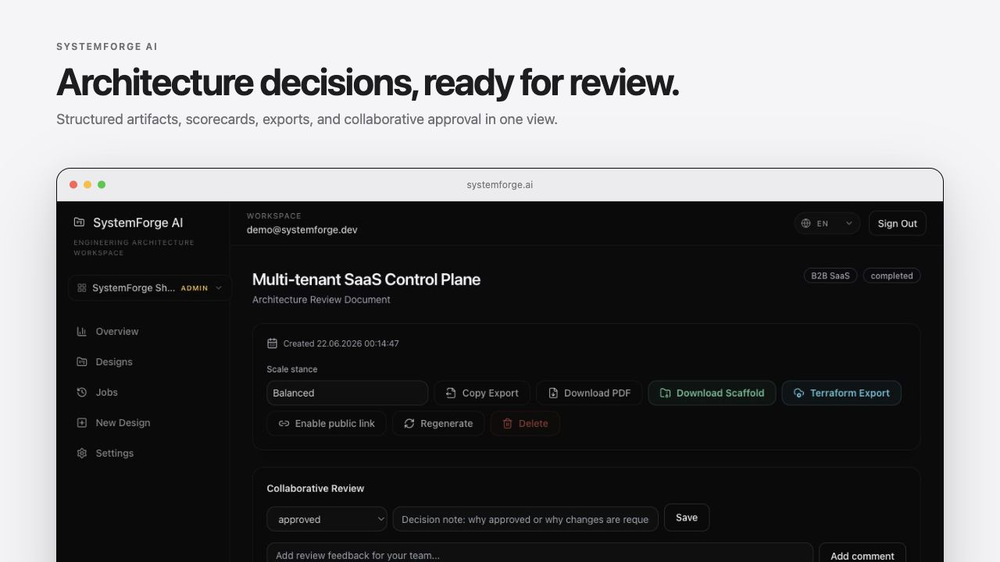
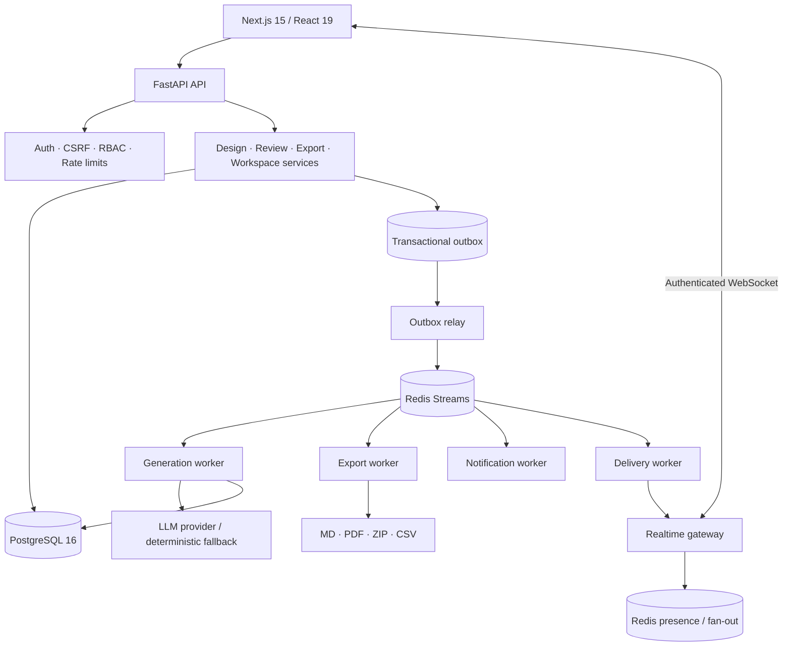

<div align="center">
  

  <h1>SystemForge AI</h1>

  <p><strong>Turn product requirements into architecture your team can review, approve, and ship.</strong></p>

  <p>
    An open-source, artifact-first engineering workspace for generating structured system designs,
    collaborating on architecture decisions, and exporting implementation-ready deliverables.
  </p>

  <p>
    <a href="#quick-start"><strong>Quick start</strong></a>
    ·
    <a href="#product-tour"><strong>Product tour</strong></a>
    ·
    <a href="docs/ARCHITECTURE.md"><strong>Architecture</strong></a>
    ·
    <a href="docs/API_REFERENCE.md"><strong>API reference</strong></a>
    ·
    <a href="https://github.com/ardamoustafa1/SystemForge-AI/discussions"><strong>Community</strong></a>
  </p>

  <p>
    <a href="https://github.com/ardamoustafa1/SystemForge-AI/actions/workflows/codeql.yml"></a>
    <a href="LICENSE"></a>
    
    
    
    
    
  </p>
</div>

<p align="center">
  
</p>

> [!IMPORTANT]
> SystemForge AI is actively being hardened toward a stable public release. It is production-oriented, not a promise of production readiness for every environment. Review the [security posture](docs/SECURITY_POSTURE.md), [production checklist](ops/PRODUCTION_CHECKLIST.md), and generated infrastructure before deploying.

## Architecture decisions should leave the chat

Teams already use AI to reason about systems. The failure is rarely the first answer—it is everything that comes after:

- the architecture is trapped in a conversation;
- decisions have no owner, state, or history;
- generated output changes shape between prompts;
- security and cost assumptions are easy to miss;
- implementation teams receive prose instead of usable artifacts.

SystemForge AI turns a product brief into a **schema-validated architecture package** and gives the team a workspace to review it. The result is persistent, versionable, exportable, and connected to an engineering workflow.

| Typical AI chat            | SystemForge AI                                                       |
| -------------------------- | -------------------------------------------------------------------- |
| Free-form response         | Predictable, validated artifact schema                               |
| One-person conversation    | Workspace-based review and comments                                  |
| Copy/paste handoff         | Markdown, PDF, scaffold, Terraform, and task exports                 |
| Hidden revisions           | Saved output versions and design history                             |
| Diagram as an afterthought | Mermaid topology generated with the artifact                         |
| No operational path        | Workers, audit trail, observability assets, and deployment manifests |

## Product tour

<p align="center">
  <a href="docs/demo/systemforge-product-tour.mp4">
    
  </a>
</p>

<p align="center">
  <a href="docs/demo/systemforge-product-tour.mp4"><strong>▶ Watch the HD product tour</strong></a>
  ·
  <a href="docs/DEMO_SCRIPT.md">Follow the guided demo</a>
</p>

### From brief to engineering handoff



1. Capture the product context, constraints, scale stance, data sensitivity, and realtime or AI requirements.
2. Generate a structured architecture package through an LLM provider or the deterministic local fallback.
3. Review diagrams, trade-offs, security controls, cost posture, and the implementation checklist.
4. Assign a review owner, leave comments, request changes, approve, and preserve the decision history.
5. Export the result into formats that engineering and platform teams can continue working with.

## What it generates

Every design is normalized into a reviewable package instead of an unpredictable wall of text.

| Artifact area     | Included output                                                                    |
| ----------------- | ---------------------------------------------------------------------------------- |
| Executive context | Summary, assumptions, functional and non-functional requirements                   |
| System design     | Runtime topology, component responsibilities, data flow, integration boundaries    |
| Data architecture | Entities, persistence strategy, indexing, migration, retention considerations      |
| Realtime          | WebSocket strategy, fan-out, presence, delivery, recovery, and scaling notes       |
| AI orchestration  | Provider boundaries, fallback behavior, token/cost controls, failure handling      |
| Security          | Auth flow, tenant isolation, secrets, abuse protection, audit and compliance notes |
| Reliability       | Failure modes, idempotency, retries, backpressure, observability, SLO guidance     |
| Decision support  | Trade-offs, risks, cost considerations, and consistency warnings                   |
| Delivery plan     | Implementation roadmap, engineering checklist, and Mermaid diagram                 |

### Export surfaces

| Export            | Best for                                                              |
| ----------------- | --------------------------------------------------------------------- |
| Markdown          | RFCs, repositories, wikis, pull requests, and long-term documentation |
| PDF               | Stakeholder review, architecture boards, and portable handoff         |
| Scaffold ZIP      | Starting a generated application structure from the approved design   |
| Terraform ZIP     | Reviewing an AWS-oriented infrastructure starting point               |
| Task CSV          | Moving implementation work into planning and delivery systems         |
| Public share link | Sharing a controlled, read-only architecture artifact                 |

Generated code and infrastructure are **reviewable starting points**. They are not a substitute for threat modeling, capacity planning, compliance review, or environment-specific validation.

## Built for serious engineering workflows

<table>
  <tr>
    <td width="50%" valign="top">
      <h3>Structured by default</h3>
      <p>Pydantic and Zod contracts keep generated output predictable across the API and UI. Mermaid output is sanitized and validated before rendering.</p>
    </td>
    <td width="50%" valign="top">
      <h3>Review, not just generation</h3>
      <p>Move designs through draft, in-review, approved, and changes-requested states with owners, decision notes, comments, and history.</p>
    </td>
  </tr>
  <tr>
    <td width="50%" valign="top">
      <h3>Async where it matters</h3>
      <p>Generation, export, notification, outbox, and delivery workers isolate long-running work and scale independently through Redis Streams.</p>
    </td>
    <td width="50%" valign="top">
      <h3>Workspace-first security</h3>
      <p>Tenant-aware authorization, CSRF protection, token revocation, rate limits, quotas, secure headers, and public-share controls are built into the application boundary.</p>
    </td>
  </tr>
  <tr>
    <td width="50%" valign="top">
      <h3>Realtime visibility</h3>
      <p>Authenticated WebSockets carry progress, presence, job, export, and collaboration events without making ephemeral state the source of truth.</p>
    </td>
    <td width="50%" valign="top">
      <h3>Self-hostable operations</h3>
      <p>Docker Compose, Kubernetes manifests, Helm, Grafana, alert rules, health checks, autoscaling, network policy, and incident runbooks live in the repository.</p>
    </td>
  </tr>
</table>

## Who it is for

### Engineering leaders

Create a repeatable path from product intent to architecture review. Make assumptions, risks, ownership, and approval visible before implementation expands the cost of change.

### Staff and principal engineers

Use a consistent artifact shape to compare options, expose trade-offs, document boundaries, and turn architecture work into a durable organizational asset.

### Platform and DevOps teams

Receive explicit runtime, data, observability, security, cost, and deployment considerations—plus scaffold and infrastructure exports that can be inspected rather than copied blindly.

### Product engineering teams

Start implementation with shared context, an engineering checklist, and a review trail instead of reconstructing decisions from meetings and chat threads.

## Real product screens

<p align="center">
  
</p>

<table>
  <tr>
    <td width="50%">
      
    </td>
    <td width="50%">
      
    </td>
  </tr>
  <tr>
    <td align="center"><sub>Design portfolio, pending reviews, cost posture, and risk drift</sub></td>
    <td align="center"><sub>Artifact review, approval state, comments, and one-click exports</sub></td>
  </tr>
</table>

## Enterprise-ready foundations

SystemForge includes the boundaries teams expect when architecture data moves beyond a personal prototype.

### Identity and authorization

- workspace-scoped membership and role checks;
- secure cookie authentication and CSRF double-submit validation;
- JWT token-version revocation;
- authenticated WebSocket sessions;
- public share links with explicit controls;
- authorization contract documentation and RBAC tests.

### Application and AI safety

- global security response headers;
- prompt sanitization and injection redaction guards;
- API and WebSocket abuse throttling;
- usage quotas and live cost controls;
- notification and security-log redaction;
- schema validation at model, API, and client boundaries.

### Operational evidence

- security audit stream and settings UI;
- CodeQL, dependency audits, and CI security gates;
- OpenTelemetry configuration surface;
- Grafana SLO dashboard and Prometheus-style alert rules;
- runbooks for database failover, Redis memory pressure, worker backpressure, and SLO incidents;
- SBOM, provenance, checksums, and signed-container release workflow assets.

Read the full [security posture](docs/SECURITY_POSTURE.md), [threat model](docs/THREAT_MODEL.md), [authorization matrix](docs/AUTHZ_CONTRACT_MATRIX.md), and [production checklist](ops/PRODUCTION_CHECKLIST.md).

## Architecture

SystemForge uses PostgreSQL as the durable source of truth and a transactional outbox to bridge database commits into Redis Streams. Long-running work is processed by independently scalable workers; delivery events are routed to authenticated WebSocket clients.



The transactional outbox prevents the classic split-brain failure where a design record is committed but its background job is lost. See the [architecture deep dive](docs/ARCHITECTURE.md) and [ADR-001](docs/ADR-001-workspace-first-authz.md).

## Tech stack

| Layer      | Technology                                                                         |
| ---------- | ---------------------------------------------------------------------------------- |
| Web        | Next.js 15, React 19, TypeScript, Tailwind CSS, SWR, Zod, Mermaid, React Flow      |
| API        | FastAPI, Pydantic, SQLAlchemy, Alembic                                             |
| Data       | PostgreSQL 16, Redis 7, Redis Streams                                              |
| Realtime   | WebSocket gateway, presence service, cross-node fan-out                            |
| Workers    | Generation, export, outbox relay, delivery, notification                           |
| AI         | Provider-based generation pipeline with deterministic schema-valid fallback        |
| Operations | Docker Compose, Kubernetes, Helm, HPA, network policies, Grafana, alerts, runbooks |
| Quality    | Pytest, Vitest, Playwright, k6, Ruff, ESLint, CodeQL, GitHub Actions               |

## Quick start

### One-command Docker demo

Requirements: Docker with Compose v2 and enough memory to run the web, API, PostgreSQL, Redis, and worker containers.

```bash
git clone https://github.com/ardamoustafa1/SystemForge-AI.git
cd SystemForge-AI
cp .env.example .env
docker compose up --build
```

Then open:

| Service               | URL                              |
| --------------------- | -------------------------------- |
| Web application       | http://localhost:3000            |
| OpenAPI documentation | http://localhost:8000/docs       |
| API health            | http://localhost:8000/api/health |

The Compose stack seeds an idempotent local showcase workspace:

```text
Email:    demo@systemforge.dev
Password: SystemForgeDemo123!
```

> [!TIP]
> An OpenAI API key is optional for local evaluation. Without one, SystemForge uses its deterministic fallback generator so you can still explore schema-valid artifacts, review, exports, and the complete application workflow.

The demo includes:

1. Multi-tenant SaaS Control Plane
2. Marketplace Order & Fulfillment Platform
3. AI Workflow Automation Hub

Use [the 3-minute demo script](docs/DEMO_SCRIPT.md) for a guided walkthrough.

### Run the development stack

Backend:

```bash
cd backend
python3 -m venv .venv
source .venv/bin/activate
pip install -e ".[dev]"
alembic upgrade head
uvicorn app.main:app --reload
```

Frontend, in another terminal:

```bash
cd frontend
npm ci
npm run dev
```

PostgreSQL and Redis must be available through the URLs configured in `backend/.env`.

## Configuration

Start with the committed example:

```bash
cp .env.example .env
```

| Variable                              | Purpose                                                    | Local default                      |
| ------------------------------------- | ---------------------------------------------------------- | ---------------------------------- |
| `BACKEND_DATABASE_URL`                | PostgreSQL connection used by API and workers              | Compose PostgreSQL                 |
| `BACKEND_REDIS_URL`                   | Redis connection for streams, limits, presence, and events | Compose Redis                      |
| `BACKEND_JWT_SECRET`                  | Token signing secret                                       | Development placeholder—replace it |
| `BACKEND_METRICS_SECRET`              | Protects privileged metrics access                         | Development placeholder—replace it |
| `BACKEND_OPENAI_API_KEY`              | Enables provider-backed generation                         | Empty; fallback remains available  |
| `BACKEND_OPENAI_BASE_URL`             | OpenAI-compatible provider endpoint                        | `https://api.openai.com/v1`        |
| `BACKEND_OPENAI_MODEL`                | Generation model identifier                                | `gpt-4.1-mini`                     |
| `BACKEND_OTEL_EXPORTER_OTLP_ENDPOINT` | OpenTelemetry collector endpoint                           | Empty                              |
| `PUBLIC_APP_URL`                      | Public application origin used in generated links          | `http://localhost:3000`            |

Never use the example secrets in a shared or production environment. Prefer an external secret manager and follow the [secrets rotation runbook](docs/SECRETS_ROTATION_BREAK_GLASS.md).

## API surface

The FastAPI application publishes an OpenAPI document and interactive docs at `/docs`.

| Group                          | Responsibility                                             |
| ------------------------------ | ---------------------------------------------------------- |
| `/api/auth/*`                  | Registration, sign-in, session lifecycle, token revocation |
| `/api/workspaces/*`            | Workspace lifecycle, members, roles, quotas                |
| `/api/designs/*`               | Design creation, generation, review, comments, history     |
| `/api/designs/{id}/versions/*` | Saved output versions and comparisons                      |
| `/api/designs/{id}/export*`    | Markdown, PDF, scaffold, Terraform, and queued exports     |
| `/api/public/share/*`          | Controlled read-only artifact sharing                      |
| `/api/dashboard/*`             | Portfolio and operational summaries                        |
| `/api/security/*`              | Security audit surfaces                                    |
| `/api/health*`                 | Liveness and dependency health                             |
| `/api/ws`                      | Authenticated realtime protocol                            |

See the [API reference](docs/API_REFERENCE.md) and [API versioning policy](docs/API_VERSIONING.md).

## Showcase exports

The repository includes concrete examples that let you inspect the output without running the platform:

- [SaaS control plane architecture](examples/saas-control-plane/architecture.md) — tenant boundaries, RBAC, auditability, and async work.
- [Marketplace Docker Compose](examples/marketplace-platform/docker-compose.yml) — order, inventory, payment, and fulfillment direction.
- [AI workflow infrastructure](examples/ai-workflow-hub/) — provider fallback, queue backpressure, Kubernetes, and Terraform.

Read the [showcase guide](docs/SHOWCASE_EXAMPLES.md) or browse the [examples index](examples/README.md).

## Quality and verification

Run the core checks:

```bash
ruff check backend/app backend/tests
pytest backend/tests -q

cd frontend
npm run lint
npm run test
npm run build
npm run test:e2e
```

The test surface covers authentication security, workspace authorization, generation contracts, exports, versioning, Mermaid handling, realtime delivery, WebSocket protocol behavior, presence, workers, cost controls, and end-to-end user flows.

### Load testing

```bash
BASE_URL=http://localhost:8000/api \
AUTH_COOKIE='...' \
CSRF='...' \
WORKSPACE_ID='1' \
k6 run ops/load-tests/k6-systemforge.js
```

The current local HTTP health smoke result is documented as **56.01 req/s average, 14.68 ms p95, and 0.00% errors** with up to 100 configured virtual users. This measures the health endpoint and HTTP stack—not generation or export capacity. Reproduce and record hardware, commit, dataset, RPS, p95, and error rate before using benchmark numbers in a deployment decision.

See the [benchmark plan](docs/BENCHMARK_PLAN.md) and [load test report](docs/LOAD_TEST_REPORT.md).

## Deployment

### Docker Compose

Best for local evaluation and development. The stack includes PostgreSQL, Redis, migrations, demo seeding, API, frontend, and five worker roles.

### Kubernetes and Helm

The `ops/` directory includes:

- backend, frontend, and worker deployments;
- horizontal pod autoscaling and disruption budgets;
- ingress and network policy;
- PostgreSQL and Redis development dependencies;
- migration job;
- Helm values and templates;
- Grafana dashboard, alert rules, and operational runbooks.

For production, use managed PostgreSQL with point-in-time recovery, an external secret manager, TLS, a WAF or edge protection, environment-specific CORS, and tested backup/restore procedures. Start with the [production checklist](ops/PRODUCTION_CHECKLIST.md).

## Repository map

```text
.
├── frontend/                 # Next.js application, UI, schemas, unit and E2E tests
├── backend/                  # FastAPI API, domain services, workers, migrations, tests
├── docs/                     # Architecture, security, governance, API, demo, benchmarks
├── examples/                 # Reviewable architecture and infrastructure exports
├── ops/                      # Docker/K8s/Helm, observability, alerts, runbooks, load tests
├── .github/                  # CI, CodeQL, releases, templates, dependency automation
├── docker-compose.yml        # Full local showcase stack
├── CHANGELOG.md
├── CONTRIBUTING.md
├── SECURITY.md
└── ROADMAP.md
```

## Project status and roadmap

SystemForge is under active development. The near-term release work is intentionally explicit:

- keep CI green from a clean checkout;
- expand cross-browser and mobile E2E coverage;
- publish signed release artifacts and provenance;
- run reproducible generation and export benchmarks;
- deepen Terraform, Docker, Kubernetes, and task export validation;
- continue security hardening and operational exercises.

Track the detailed plan in [ROADMAP.md](ROADMAP.md) and release history in [CHANGELOG.md](CHANGELOG.md).

## Contributing

Contributions are welcome—especially focused tests, export validation, mobile polish, docs, accessibility, security hardening, and reproducible performance work.

1. Read [CONTRIBUTING.md](CONTRIBUTING.md).
2. Pick a scoped task from [good first issues](docs/GOOD_FIRST_ISSUES.md) or open a discussion.
3. Add tests for behavior changes.
4. Run the relevant quality checks.
5. Open a focused pull request with screenshots or evidence where useful.

Community resources:

- [GitHub Discussions](https://github.com/ardamoustafa1/SystemForge-AI/discussions)
- [Maintainer guide](docs/MAINTAINER_GUIDE.md)
- [Code of Conduct](CODE_OF_CONDUCT.md)
- [Security policy](SECURITY.md)
- [Release process](docs/RELEASE_PROCESS.md)

## Support the project

If SystemForge helps your team think more clearly about architecture:

- star the repository so other engineering teams can find it;
- share a real architecture workflow or export format you want supported;
- open an issue with a reproducible failure case;
- contribute a test, integration, template, or deployment improvement;
- [sponsor continued development](https://github.com/sponsors/ardamoustafa1).

## License

SystemForge AI is available under the [MIT License](LICENSE).

<div align="center">
  <br />
  <strong>Make architecture a reviewable engineering artifact—not a disappearing conversation.</strong>
</div>
