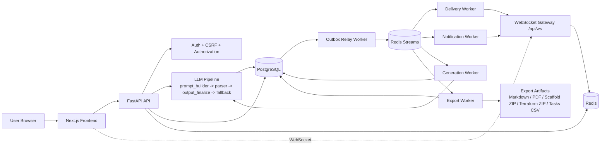

# SystemForge AI

SystemForge AI, ürün gereksinimlerini üretime hazır sistem tasarımı çıktılarina dönüstüren, full-stack bir AI Engineering Workspace platformudur.

Platform, klasik "chatbot" deneyiminden farkli olarak **artifact-first** yaklasimla tasarlanmistir: üretim; inceleme; versiyonlama; güvenlik; export ve ekip içi teslim akisi tek bir yerde birlesir.

Repository: [github.com/ardamoustafa1/SystemForge-AI](https://github.com/ardamoustafa1/SystemForge-AI)

English version: [README.en.md](README.en.md)


## Icerik

- [Demo](#demo)
- [1. Projenin Amaci](#1-projenin-amaci)
- [2. One Cikan Yetenekler](#2-one-cikan-yetenekler)
- [3. Mimari Genel Bakis](#3-mimari-genel-bakis)
- [4. Teknik Mimari Detaylari](#4-teknik-mimari-detaylari)
- [5. Modul ve Klasor Yapisi](#5-modul-ve-klasor-yapisi)
- [6. API Yuzeyi](#6-api-yuzeyi)
- [7. Kurulum ve Calistirma](#7-kurulum-ve-calistirma)
- [8. Konfigurasyon ve Ortam Degiskenleri](#8-konfigurasyon-ve-ortam-degiskenleri)
- [9. Veritabani ve Migration](#9-veritabani-ve-migration)
- [10. Test ve Kalite Guvenceleri](#10-test-ve-kalite-guvenceleri)
- [11. Guvenlik Modeli](#11-guvenlik-modeli)
- [12. Dokumantasyon Haritasi](#12-dokumantasyon-haritasi)
- [13. Complete Tech Matrix](#13-complete-tech-matrix)
- [14. Docker Services Manifest](#14-docker-services-manifest)
- [15. Full Environment Variables Reference](#15-full-environment-variables-reference)
- [16. Operasyonel Quick Runbook](#16-operasyonel-quick-runbook)
- [17. Production Hardening Checklist](#17-production-hardening-checklist)
- [18. Contributing Rehberi](#18-contributing-rehberi)
- [19. ADR Index](#19-adr-index)
- [20. Changelog Politikasi](#20-changelog-politikasi)
- [21. Yol Haritasi ve Kisitlar](#21-yol-haritasi-ve-kisitlar)
- [22. Lisans](#22-lisans)

## Demo

Bu bölüm GitHub ziyaretçisinin projeyi 10-15 saniyede anlamasi için hazirlandi.

### Product Demo (GIF)

Demo GIF bölümü bu sürümde kaldirildi. Proje akisini hizli incelemek için asagidaki "Use Case" adimlarini takip edebilirsin.

### Architecture (Highlighted)

Mimari diyagram bu README içinde `3. Mimari Genel Bakis` bölümünde yer alir ve gerçek servis topolojisini gösterir:

- Next.js frontend -> FastAPI API
- Auth/CSRF/authorization + LLM pipeline
- PostgreSQL + Redis + Redis Streams
- Outbox, delivery, notification, generation, export worker akislari

### Use Case (Nasil Yapacagiz?)

Temel kullanim senaryosu:

1. Dashboard'dan yeni bir design brief olustur.
2. Gereksinimleri ve teknik baglami girip generation baslat.
3. Üretilen architecture ciktilarini (summary, trade-off, checklist, diagram) incele.
4. Review durumunu güncelle (`in_review` / `approved`) ve yorum ekle.
5. Gerekirse regenerate veya version compare/explain akislarini kullan.
6. Son ciktiyi Markdown/PDF/ZIP/CSV formatlarinda export et.

## 1. Projenin Amaci

Mühendislik ekipleri mimari tasarim sürecinde genelde daginik araclar kullanir: Notion, Slack, whiteboard, LLM chat pencereleri. Bu daginiklik kararlarin izlenmesini, review sürecini ve uygulanabilir teslimati zorlastirir.

SystemForge AI bu boslugu su sekilde kapatir:

- Ham gereksinimleri standart bir design brief modeline dönüstürür.
- LLM üretimini katı schema sözlesmesi ile dogrular.
- Ekip review, yorum, sürüm kiyaslama ve karar tarihcesi sunar.
- Ciktilari Markdown, PDF, ZIP ve CSV olarak disa aktarir.
- Workspace-bazli yetkilendirme ve operasyon görünürlügü saglar.

## 2. One Cikan Yetenekler

### Ürün Yetenekleri

- AI destekli sistem tasarimi üretimi (schema-first)
- Executive summary, functional/non-functional requirements, architecture notes, trade-off ve implementation checklist üretimi
- Mermaid diyagram üretimi, düzenleme ve senkronizasyon
- Cost estimation ve scenario-based cost analysis
- Review durumlari: `draft`, `in_review`, `approved`, `changes_requested`
- Yorumlar, timeline ve sürüm karsilastirma
- Public read-only share linkleri
- Asenkron export job merkezi (status + download)
- Workspace, üyelik, rol ve bütce yönetimi

### Mühendislik Yetenekleri

- FastAPI + SQLAlchemy + Pydantic ile sözlesme-temelli backend
- Next.js App Router + TypeScript + SWR tabanli frontend
- Redis Streams + WebSocket ile realtime dagitim
- Generation, export, outbox, delivery, notification worker topolojisi
- Docker Compose ile yerel tam stack orkestrasyonu
- CI boru hatti (backend checks/tests, frontend type/build/E2E, audit)

## 3. Mimari Genel Bakis

Asagidaki diyagram SystemForge AI'nin repository'deki gerçek servis/topoloji yapisini gösterir:



### Kisa Akis Özeti

1. Kullanici `frontend` (Next.js) üzerinden API ve WebSocket baglantilarini baslatir.
2. `backend` (FastAPI) tarafinda auth, CSRF, yetkilendirme ve request validasyon kontrolleri çalisir.
3. Design generation akisi `backend/app/llm/` pipeline'i ile yürür: prompt olusturma, parse, finalize, fallback.
4. Kalici veriler PostgreSQL'e yazilir; event odakli dagitim için outbox + Redis Streams kullanilir.
5. Worker'lar (`generation`, `export`, `outbox`, `delivery`, `notification`) asenkron isleri tüketir ve üretir.
6. Realtime eventler delivery/notification workerlari üzerinden WebSocket gateway'e iletilir.
7. Export worker, artefact ciktilarini (Markdown/PDF/ZIP/CSV) olusturur ve job merkezine baglar.

## 4. Teknik Mimari Detaylari

### Uygulama Katmanlari

- **Frontend (`frontend/`)**: Dashboard, design editor, review panel, settings, auth ve i18n.
- **API (`backend/app/api/routes/`)**: REST kontratlari ve endpoint katmani.
- **Domain Services (`backend/app/services/`)**: Design generation, export, authz, security, job orchestration.
- **LLM Pipeline (`backend/app/llm/`)**: Prompt builder, parser, fallback, output finalize, mermaid sanitize.
- **Realtime (`backend/app/realtime/`)**: WebSocket gateway ve connection manager.
- **Workers (`backend/app/workers/`)**: Generation/export/outbox/delivery/notification consumerlari.

### Veri ve Mesajlasma Katmani

- **PostgreSQL**: Kalici domain verisi, design artefactlar, review/comment/sürüm kayitlari.
- **Redis**: Cache ve stream tabanli event dagitimi.
- **Redis Streams**:
  - `sf:rt:v1:stream:delivery`
  - `sf:rt:v1:stream:realtime:{user_id}`
  - `sf:rt:v1:stream:notify`
  - `sf:rt:v1:stream:notify:delayed`

### Worker Sorumluluklari

- `backend-generation-worker`: Asenkron design generation islerini yürütür.
- `backend-export-worker`: PDF/Markdown vb. export islerini üretir.
- `backend-outbox-worker`: DB outbox kayitlarini stream'e publish eder.
- `backend-delivery-worker`: Eventleri aktif kullanicilara dagitir.
- `backend-notification-worker`: Gecikmeli/offline bildirim dagitimini yönetir.

## 5. Modul ve Klasor Yapisi

```text
systemforge-ai/
├─ .github/workflows/         # CI workflows
├─ backend/
│  ├─ alembic/                # Migration dosyalari
│  ├─ app/
│  │  ├─ api/routes/          # Endpoint tanimlari
│  │  ├─ auth/                # Auth service + dependency
│  │  ├─ core/                # Config, security, errors, rate limiter
│  │  ├─ db/                  # Session/base setup
│  │  ├─ llm/                 # Prompt, parser, fallback, finalize
│  │  ├─ messaging/           # Outbox/realtime messaging modelleri
│  │  ├─ models/              # SQLAlchemy modelleri
│  │  ├─ realtime/            # WebSocket gateway
│  │  ├─ schemas/             # Pydantic kontratlari
│  │  ├─ services/            # Domain servisleri
│  │  └─ workers/             # Background workers
│  ├─ requirements.txt
│  └─ Dockerfile
├─ frontend/
│  ├─ app/                    # Next.js App Router sayfalari
│  ├─ components/             # UI bilesenleri
│  ├─ features/               # Özellik bazli istemci mantigi
│  ├─ i18n/                   # Cok dil altyapisi
│  ├─ lib/                    # API/WS client, util, env
│  ├─ types/                  # Frontend tipleri
│  └─ Dockerfile
├─ docs/                      # Mimari, güvenlik, governance belgeleri
├─ ops/                       # Alarm/rubook/dashboard varliklari
├─ SECURITY.md
├─ Makefile
├─ docker-compose.yml
└─ README.md
```

## 6. API Yuzeyi

### Auth

- `POST /api/auth/register`
- `POST /api/auth/login`
- `POST /api/auth/logout`
- `POST /api/auth/refresh`
- `GET /api/auth/me`
- `GET /api/auth/sessions`
- `DELETE /api/auth/sessions/{session_id}`

### Designs

- `POST /api/designs`
- `GET /api/designs`
- `GET /api/designs/{id}`
- `DELETE /api/designs/{id}`
- `POST /api/designs/{id}/regenerate`
- `PATCH /api/designs/{id}/notes`
- `PATCH /api/designs/{id}/architecture`
- `GET /api/designs/{id}/review`
- `PATCH /api/designs/{id}/review`
- `GET /api/designs/{id}/comments`
- `POST /api/designs/{id}/comments`
- `GET /api/designs/{id}/timeline`
- `GET /api/designs/{id}/cost-calibration`
- `POST /api/designs/{id}/cost-analysis`

### Versions and Public Share

- `GET /api/designs/{id}/versions`
- `GET /api/designs/{id}/versions/{version_id}`
- `GET /api/designs/{id}/versions/compare`
- `GET /api/designs/{id}/versions/explain`
- `GET /api/designs/{id}/share`
- `POST /api/designs/{id}/share`
- `DELETE /api/designs/{id}/share`
- `GET /api/public/share/{token}`
- `GET /api/public/share/{token}/export`

### Exports

- `GET /api/designs/{id}/export?format=markdown|pdf`
- `POST /api/designs/{id}/export-jobs?format=pdf|markdown`
- `GET /api/designs/export-jobs/{job_id}`
- `GET /api/designs/export-jobs/{job_id}/download`
- `GET /api/designs/{id}/export/scaffold`
- `GET /api/designs/{id}/export/terraform`
- `GET /api/designs/{id}/export/tasks-csv?provider=jira|linear`

### Workspaces

- `GET /api/workspaces`
- `POST /api/workspaces`
- `GET /api/workspaces/{workspace_id}`
- `PATCH /api/workspaces/{workspace_id}`
- `DELETE /api/workspaces/{workspace_id}`
- `POST /api/workspaces/{workspace_id}/default`
- `GET /api/workspaces/{workspace_id}/budget`
- `PATCH /api/workspaces/{workspace_id}/budget`
- `POST /api/workspaces/{workspace_id}/members`
- `PATCH /api/workspaces/{workspace_id}/members/{member_id}`
- `DELETE /api/workspaces/{workspace_id}/members/{member_id}`

### Ops, Security, Health, Realtime

- `GET /api/dashboard/ops-summary`
- `GET /api/security/abuse-summary`
- `GET /api/security/anomaly-summary`
- `GET /api/security/audit-trail`
- `GET /api/health`
- `GET /api/health/ready`
- `GET /api/health/api-versions`
- `GET /api/ws`

## 7. Kurulum ve Calistirma

### A) Docker Compose ile hizli baslangic (önerilen)

```bash
cp .env.example .env
docker compose up --build
```

Ardindan:

- Frontend: [http://localhost:3000](http://localhost:3000)
- Backend Swagger: [http://localhost:8000/docs](http://localhost:8000/docs)
- Health: [http://localhost:8000/api/health](http://localhost:8000/api/health)

### B) Docker olmadan lokal gelistirme

Backend:

```bash
cd backend
python3 -m venv .venv
source .venv/bin/activate
pip install -r requirements.txt
cp .env.example .env
alembic upgrade head
uvicorn app.main:app --reload
```

Frontend:

```bash
cd frontend
npm install
cp .env.example .env.local
npm run dev
```

Gerekli lokal servisler:

- PostgreSQL
- Redis

### Yararlı Make komutlari

```bash
make up
make down
make rebuild
make logs
```

## 8. Konfigurasyon ve Ortam Degiskenleri

`docker-compose.yml` ve runtime için temel degiskenler:

- `POSTGRES_DB`
- `POSTGRES_USER`
- `POSTGRES_PASSWORD`
- `BACKEND_DATABASE_URL`
- `BACKEND_REDIS_URL`
- `BACKEND_JWT_SECRET`
- `BACKEND_OPENAI_API_KEY`
- `BACKEND_OPENAI_BASE_URL`
- `BACKEND_OPENAI_MODEL`
- `BACKEND_AUTO_CREATE_TABLES`
- `FRONTEND_NEXT_PUBLIC_API_URL`
- `FRONTEND_NEXT_PUBLIC_APP_NAME`

Önemli notlar:

- `BACKEND_OPENAI_BASE_URL` OpenAI uyumlu saglayicilar için kullanilabilir.
- Production ortaminda güçlü bir `JWT_SECRET` zorunludur.
- `AUTO_CREATE_TABLES`, production/distributed ortamlarda `false` olmalidir.
- Public share linkleri için frontend origin degeri dogru set edilmelidir.

## 9. Veritabani ve Migration

Alembic migration komutu:

```bash
cd backend
alembic upgrade head
```

Docker ile migration:

```bash
docker compose run --rm backend sh -lc "/app/scripts/migrate.sh"
```

Davranis notlari:

- Güvensiz security ayarlari tespit edilirse backend non-dev ortamlarda fail-fast davranir.
- Compose yapisinda `backend-migrate` one-shot servisi bulunur.
- Backend/worker servisleri migration tamamlanmadan ayaga kalkmaz.

## 10. Test ve Kalite Guvenceleri

Backend test:

```bash
docker compose run --rm backend-test
```

veya:

```bash
cd backend
pytest tests -q
```

Frontend kalite adimlari:

```bash
cd frontend
npm run build
npm run test
npm run test:e2e
```

CI pipeline kapsaminda:

- Backend static checks (`ruff`, `pyre`)
- Backend testleri (Docker)
- Frontend type/build/E2E
- Dependency audit adimlari

## 11. Guvenlik Modeli

SystemForge AI, güvenligi uygulama seviyesinde varsayilan olarak ele alir:

- HTTP-only cookie tabanli session auth
- Mutating endpointlerde CSRF korumasi
- Workspace-aware authorization kontrolleri
- Export ve design erisimlerinde ownership dogrulamasi
- Request boyutu ve girdi kontrati kontrolleri
- Session görünürlügü ve revocation endpointleri
- Public share tokenlari ile read-only erisim modeli
- Security response header ve API version/deprecation headerlari

Detaylar: [SECURITY.md](SECURITY.md)

## 12. Dokumantasyon Haritasi

`docs/` altindaki önemli belgeler:

- [Case Study](docs/CASE_STUDY.md)
- [ADR-001 Workspace-First Authz](docs/ADR-001-workspace-first-authz.md)
- [Threat Model](docs/THREAT_MODEL.md)
- [Security Posture](docs/SECURITY_POSTURE.md)
- [Benchmark Plan](docs/BENCHMARK_PLAN.md)
- [API Versioning Policy](docs/API_VERSIONING.md)
- [API Governance Playbook](docs/API_CONTRACT_GOVERNANCE_PLAYBOOK.md)
- [Load Test Report](docs/LOAD_TEST_REPORT.md)
- [Authz Contract Matrix](docs/AUTHZ_CONTRACT_MATRIX.md)
- [Async DB Migration Roadmap](docs/ASYNC_DB_MIGRATION_ROADMAP.md)
- [Secrets Rotation & Break-Glass](docs/SECRETS_ROTATION_BREAK_GLASS.md)
- [WebSocket Fanout Simplification](docs/WEBSOCKET_FANOUT_SIMPLIFICATION.md)

## 13. Complete Tech Matrix

Bu bölüm repository dosyalarina göre (özellikle `frontend/package.json`, `backend/requirements.txt`, `docker-compose.yml`) teknolojilerin tam envanterini özetler.

### Frontend Runtime

- `next` (Next.js 15)
- `react` / `react-dom` (React 19)
- `typescript`
- `tailwindcss`, `postcss`, `autoprefixer`, `tailwindcss-animate`
- `swr`
- `react-hook-form`, `@hookform/resolvers`, `zod`
- `mermaid`
- `@xyflow/react` (node/edge tabanli diyagram akislari)
- `framer-motion`
- `lucide-react`
- `class-variance-authority`, `clsx`, `tailwind-merge`
- `@radix-ui/react-slot`

### Frontend Testing and Tooling

- `vitest`
- `@playwright/test`
- `jsdom`
- `@types/node`, `@types/react`

### Backend Runtime

- `fastapi`
- `uvicorn[standard]`
- `sqlalchemy`
- `psycopg[binary]`
- `pydantic`, `pydantic-settings`
- `redis`
- `httpx`
- `alembic`
- `fpdf2` (PDF export)
- `sentry-sdk[fastapi]`
- `python-jose` (JWT)
- `passlib[bcrypt]`, `bcrypt` (password hashing)
- `python-multipart`
- `email-validator`

### Backend Testing

- `pytest`
- `pytest-asyncio`

### Data, Infra and Delivery

- PostgreSQL 16
- Redis 7
- Docker + Docker Compose
- Multi-worker background processing (generation/export/outbox/delivery/notification)
- GitHub Actions CI pipelines (`.github/workflows/ci.yml`)

## 14. Docker Services Manifest

`docker-compose.yml` icindeki servis topolojisi:

- `postgres`: kalici veritabani servisi (`postgres:16`)
- `redis`: cache + stream altyapisi (`redis:7`)
- `backend`: FastAPI ana API servisi
- `backend-migrate`: one-shot migration servisi (`/app/scripts/migrate.sh`)
- `backend-generation-worker`: async generation consumer
- `backend-export-worker`: async export consumer
- `backend-outbox-worker`: DB outbox -> stream relay
- `backend-delivery-worker`: stream -> user fanout/delivery
- `backend-notification-worker`: delayed/offline notification retries
- `backend-test`: backend test imaji/servisi
- `frontend`: Next.js UI servisi

Servis davranis notlari:

- `backend` ve tum worker servisleri `backend-migrate` basarili tamamlanmadan ayaga kalkmaz.
- Worker servislerinde healthcheck (worker tipine göre) tanimlidir.
- `frontend`, `backend` health check "healthy" olmadan baslamaz.

## 15. Full Environment Variables Reference

Bu bölümde tum degiskenler iki seviyede listelenmistir:
- **Runtime vars**: uygulamanin dogrudan okudugu degiskenler (`backend/app/core/config.py`, `frontend/lib/env.ts`)
- **Compose bridge vars**: `.env` tarafinda tanimlanip container runtime varlarina map edilen degiskenler (`docker-compose.yml`)

### 15.1 Backend Runtime Variables (`backend/app/core/config.py`)

#### App/API
- `APP_NAME` (default: `SystemForge AI API`)
- `APP_ENV` (default: `development`)
- `API_PREFIX` (default: `/api`)
- `API_VERSION` (default: `v1`)
- `API_DEPRECATION_POLICY_URL` (default: `https://semver.org/`)
- `API_DEPRECATED_AFTER` (default: empty)
- `API_SUNSET_AT` (default: empty)
- `CORS_ORIGINS` (default: `http://localhost:3000`)
- `PUBLIC_APP_URL` (default: `http://localhost:3000`)

#### Mermaid/PDF Rendering
- `MERMAID_PDF_RENDER_ENABLED` (default: `true`)
- `KROKI_URL` (default: `https://kroki.io`)
- `KROKI_TIMEOUT_SECONDS` (default: `20.0`)

#### Data Stores
- `DATABASE_URL` (default local postgres URL)
- `REDIS_URL` (default: `redis://localhost:6379/0`)

#### Auth/Cookie/JWT
- `JWT_SECRET` (default: `change-me`, productionda degistirilmeli)
- `JWT_ALGORITHM` (default: `HS256`)
- `JWT_EXP_MINUTES` (default: `720`)
- `REFRESH_EXP_DAYS` (default: `14`)
- `AUTH_COOKIE_NAME` (default: `sf_access_token`)
- `REFRESH_COOKIE_NAME` (default: `sf_refresh_token`)
- `CSRF_COOKIE_NAME` (default: `sf_csrf_token`)
- `COOKIE_SECURE` (default: `false`)
- `COOKIE_SAMESITE` (default: `lax`)

#### LLM and Generation
- `OPENAI_API_KEY`
- `OPENAI_MODEL` (default: `gpt-4.1-mini`)
- `OPENAI_BASE_URL` (default: `https://api.openai.com/v1`)
- `GENERATION_TIMEOUT_SECONDS` (default: `90`)
- `MAX_GENERATION_PAYLOAD_BYTES` (default: `65536`)

#### Rate Limit / Observability
- `RATE_LIMIT_PER_MINUTE` (default: `30`)
- `SENTRY_DSN`
- `AUTO_CREATE_TABLES` (default: `false`; prod ortamda `false` kalmali)

#### Outbox Relay
- `OUTBOX_RELAY_BATCH_SIZE` (default: `200`)
- `OUTBOX_RELAY_POLL_MS` (default: `500`)
- `OUTBOX_RELAY_PROCESSING_TIMEOUT_SECONDS` (default: `60`)
- `OUTBOX_RELAY_MAX_BACKOFF_SECONDS` (default: `300`)
- `OUTBOX_STREAM_PREFIX` (default: `sf:rt:v1:stream`)

#### Delivery Worker
- `DELIVERY_CONSUMER_GROUP` (default: `delivery-workers`)
- `DELIVERY_CONSUMER_NAME` (default: `delivery-worker-1`)
- `DELIVERY_POLL_BLOCK_MS` (default: `2000`)
- `DELIVERY_BATCH_SIZE` (default: `100`)
- `DELIVERY_PENDING_IDLE_MS` (default: `30000`)
- `DELIVERY_RECIPIENT_DEDUPE_TTL_SECONDS` (default: `86400`)

#### Notification Worker
- `NOTIFICATION_CONSUMER_GROUP` (default: `notification-workers`)
- `NOTIFICATION_CONSUMER_NAME` (default: `notification-worker-1`)
- `NOTIFICATION_POLL_BLOCK_MS` (default: `2000`)
- `NOTIFICATION_BATCH_SIZE` (default: `100`)
- `NOTIFICATION_MAX_ATTEMPTS` (default: `5`)
- `NOTIFICATION_RETRY_BASE_SECONDS` (default: `2`)
- `NOTIFICATION_ALLOW_MOCK_TOKENS` (default: `false`)
- `NOTIFICATION_PROVIDER_MODE` (default: `mock`)
- `NOTIFICATION_PROVIDER_TIMEOUT_SECONDS` (default: `5`)
- `NOTIFICATION_FCM_WEBHOOK_URL`
- `NOTIFICATION_APNS_WEBHOOK_URL`
- `NOTIFICATION_PENDING_IDLE_MS` (default: `30000`)

#### Generation Worker
- `GENERATION_CONSUMER_GROUP` (default: `generation-workers`)
- `GENERATION_CONSUMER_NAME` (default: `generation-worker-1`)
- `GENERATION_POLL_BLOCK_MS` (default: `2000`)
- `GENERATION_BATCH_SIZE` (default: `10`)

#### Export Worker
- `EXPORT_CONSUMER_GROUP` (default: `export-workers`)
- `EXPORT_CONSUMER_NAME` (default: `export-worker-1`)
- `EXPORT_POLL_BLOCK_MS` (default: `2000`)
- `EXPORT_BATCH_SIZE` (default: `20`)

#### Stream Control and Abuse Policy
- `STREAM_MAXLEN_APPROX` (default: `200000`)
- `PROMPT_ABUSE_POLICY_MODE` (default: `log-only`; options: `block | challenge | log-only`)
- `PROMPT_ABUSE_SCORE_BLOCK_THRESHOLD` (default: `80`)
- `PROMPT_ABUSE_SCORE_CHALLENGE_THRESHOLD` (default: `50`)

### 15.2 Frontend Runtime Variables (`frontend/lib/env.ts`)

- `NEXT_PUBLIC_API_URL` (default: `http://localhost:8000/api`)
- `NEXT_PUBLIC_APP_NAME` (default: `SystemForge AI`)

Not: WebSocket endpointi, `NEXT_PUBLIC_API_URL` degerinden otomatik türetilir (`/ws` suffix).

### 15.3 Compose Bridge Variables (`docker-compose.yml`)

Root `.env` ile compose tarafinda kullanilan map degiskenleri:

- `POSTGRES_DB`
- `POSTGRES_USER`
- `POSTGRES_PASSWORD`
- `BACKEND_DATABASE_URL` -> container `DATABASE_URL`
- `BACKEND_REDIS_URL` -> container `REDIS_URL`
- `BACKEND_JWT_SECRET` -> container `JWT_SECRET`
- `BACKEND_OPENAI_API_KEY` -> container `OPENAI_API_KEY`
- `BACKEND_OPENAI_BASE_URL` -> container `OPENAI_BASE_URL`
- `BACKEND_OPENAI_MODEL` -> container `OPENAI_MODEL`
- `FRONTEND_NEXT_PUBLIC_API_URL` -> frontend `NEXT_PUBLIC_API_URL`
- `PUBLIC_APP_URL` -> backend `PUBLIC_APP_URL`
- `BACKEND_INTERNAL_URL_WS` (frontend container tarafinda internal ws bridge için)

### 15.4 Example Env Files

- `backend/.env.example` temel backend degiskenlerini içerir.
- `frontend/.env.example` temel frontend degiskenlerini içerir.
- Root `.env.example` compose odakli degisken setini içerir.

## 16. Operasyonel Quick Runbook

Bu bölüm "hizli müdahale" için en kritik komutlari tek yerde toplar.

### 16.1 Servisleri ayaga kaldir / kapat

```bash
make up
make down
make logs
```

veya dogrudan:

```bash
docker compose up --build
docker compose down
docker compose logs -f
```

### 16.2 Sağlik kontrolleri

- API health: `GET /api/health`
- API ready: `GET /api/health/ready`
- API docs: `http://localhost:8000/docs`
- Frontend: `http://localhost:3000`

Örnek CLI kontrolü:

```bash
curl -s http://localhost:8000/api/health
curl -s http://localhost:8000/api/health/ready
```

### 16.3 Migration ve schema senkronizasyonu

```bash
docker compose run --rm backend sh -lc "/app/scripts/migrate.sh"
```

Lokal backend için:

```bash
cd backend
alembic upgrade head
```

### 16.4 Worker dogrulama

Compose calisirken su servislerin "up/healthy" oldugunu kontrol et:

- `backend-generation-worker`
- `backend-export-worker`
- `backend-outbox-worker`
- `backend-delivery-worker`
- `backend-notification-worker`

Hizli kontrol:

```bash
docker compose ps
```

### 16.5 Sik rastlanan sorunlar

- **API acilmiyor**: `backend-migrate` servisini ve DB baglantisini kontrol et.
- **Realtime event gelmiyor**: `redis`, `backend-outbox-worker`, `backend-delivery-worker` loglarini kontrol et.
- **Export beklemede kaliyor**: `backend-export-worker` loglarini ve job endpointini kontrol et.
- **Auth/cookie problemi**: `CORS_ORIGINS`, `PUBLIC_APP_URL`, cookie security ayarlarini ortama göre dogrula.

## 17. Production Hardening Checklist

Production ortama cikmadan önce minimum kontrol listesi:

### 17.1 Secret ve kimlik bilgileri

- [ ] `JWT_SECRET` güçlü ve rastgele üretilmis.
- [ ] `OPENAI_API_KEY` secret manager üzerinden yönetiliyor.
- [ ] Tüm secretlar repository dışında tutuluyor.
- [ ] Düzenli secret rotation politikasi tanimli.

### 17.2 Uygulama güvenligi

- [ ] `AUTO_CREATE_TABLES=false`
- [ ] `COOKIE_SECURE=true` (HTTPS zorunlu)
- [ ] `COOKIE_SAMESITE` gereksinime göre (`lax` / `strict`)
- [ ] CSRF korumasi aktif ve test edildi.
- [ ] CORS sadece gerekli originlerle sinirlandirildi.

### 17.3 Altyapi ve ag

- [ ] PostgreSQL ve Redis public internete acik degil.
- [ ] Reverse proxy/TLS katmani aktif.
- [ ] Kaynak limitleri (CPU/memory) servis bazli tanimli.
- [ ] Backups (DB snapshot + retention) aktif.

### 17.4 Gözlemlenebilirlik

- [ ] Sentry veya esdeger error tracking aktif (`SENTRY_DSN`).
- [ ] Uygulama ve worker loglari merkezi bir yerde toplaniyor.
- [ ] Kritik alarmlar tanimli (API down, worker fail, queue lag, DB errors).
- [ ] `ops/` altindaki alert/runbook artefactlari ortama uygulanmis.

### 17.5 Dagitim ve sürümleme

- [ ] Migration adimi deployment pipeline'a dahil.
- [ ] Rollback plani dokümante edildi.
- [ ] CI kapilari (tests/build/checks) zorunlu.
- [ ] API versiyonlama/deprecation headerlari dogrulandi.

### 17.6 Performans ve dayanıklılık

- [ ] Rate limit degerleri trafik profiline göre kalibre edildi.
- [ ] Worker batch/poll degerleri yük testleriyle ayarlandi.
- [ ] Redis stream maxlen ve consumer group davranisi gözlemlendi.
- [ ] Yük test raporlarina göre kapasite planlamasi yapildi.

## 18. Contributing Rehberi

Katki süreçleri için:

- [CONTRIBUTING.md](CONTRIBUTING.md)

Kisa prensipler:

- Kücük ve odakli PR ac.
- Kod degisikligiyle birlikte ilgili test/quality adimlarini calistir.
- API kontrati veya migration degisikligi varsa PR aciklamasinda mutlaka belirt.
- Güvenlik hassasiyetlerinde `SECURITY.md` ve `docs/THREAT_MODEL.md` referanslarini takip et.

## 19. ADR Index

Architecture Decision Records:

- [ADR-001 Workspace-First Authz](docs/ADR-001-workspace-first-authz.md)

Not: Yeni önemli mimari kararlarda `docs/ADR-XXX-*.md` formatinda yeni ADR eklenmesi önerilir.

## 20. Changelog Politikasi

Degisiklik geçmisi için:

- [CHANGELOG.md](CHANGELOG.md)

Kategoriler:

- `Added`: yeni özellikler
- `Changed`: mevcut davranis güncellemeleri
- `Fixed`: hata düzeltmeleri
- `Security`: güvenlik düzeltmeleri

Versiyonlama yaklaşimi:

- Semantic Versioning (`MAJOR.MINOR.PATCH`) önerilir.
- Her release için changelog girisi olusturulmalidir.

## 21. Yol Haritasi ve Kisitlar

- E2E kapsami su an smoke seviyesinde; tam regresyon için genisletme planlanabilir.
- Bazi operasyonel wiring adimlari ortama özel konfigürasyon gerektirir.
- Yüksek concurrency senaryolarinda WebSocket fanout sadeleştirme firsatlari vardir.
- Proje, ürünlestirme kadar engineering showcase ve iteratif ürün gelistirme hedefiyle de tasarlanmistir.

## 22. Lisans

Bu repository `MIT License` ile lisanslanmistir.

- Lisans metni: [LICENSE](LICENSE)
