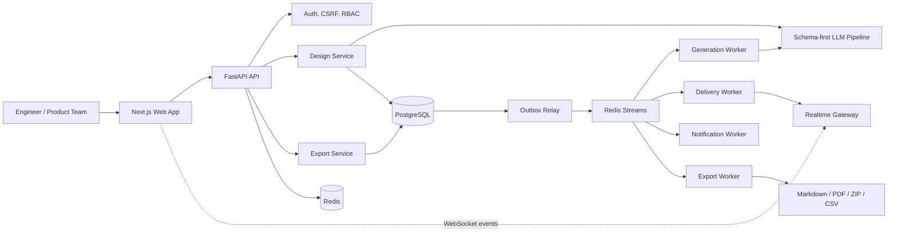

# SystemForge AI Architecture

SystemForge AI is an artifact-first architecture assistant. The product is built around one idea: architecture work should produce reviewable, versioned, exportable artifacts instead of disappearing inside a chat transcript.

## System Context

## Request Lifecycle

1. A user creates a design brief in the web app.
2. The API validates the request with Pydantic contracts, auth checks, CSRF checks, workspace membership, rate limits, and usage quotas.
3. The generation service calls the schema-first LLM pipeline. If no model provider is configured, the deterministic fallback generator still returns a valid architecture artifact for local demos.
4. The generated output is saved as structured JSON plus Markdown/PDF-ready export content.
5. Outbox and Redis Streams distribute realtime updates and background jobs.
6. Users review, comment, regenerate, share, and export the artifact.

## Core Modules

| Layer | Path | Responsibility |
|---|---|---|
| Web app | `frontend/app` | Landing, auth, dashboard, design detail, settings |
| UI components | `frontend/components` | Layout, design artifact grid, diagrams, forms |
| API routes | `backend/app/api/routes` | HTTP contracts and dependency wiring |
| Auth | `backend/app/auth` | Login, registration, current-user/session dependencies |
| Domain services | `backend/app/services` | Design generation, exports, authorization, jobs |
| LLM pipeline | `backend/app/llm` | Prompting, fallback, parsing, finalization, consistency checks |
| Realtime | `backend/app/realtime` | WebSocket gateway, protocol, presence |
| Messaging | `backend/app/messaging` | Outbox/event models and repositories |
| Workers | `backend/app/workers` | Generation, export, notification, delivery, outbox relay |
| Operations | `ops` | Helm, dashboards, alerts, runbooks, load tests |

## Data Model Highlights

- `users`: identity, password hash, token version, default workspace.
- `workspaces` and `workspace_members`: tenant boundary and RBAC.
- `designs`: top-level architecture artifact metadata.
- `design_inputs`: original brief payload.
- `design_outputs`: structured generated artifact and Markdown export.
- `design_output_versions`: regeneration history.
- `design_comments`: review collaboration.
- `outbox_events`: reliable event handoff to Redis Streams.

## Reliability Patterns

- Workspace-first authorization boundary.
- Idempotency hooks for mutation-heavy flows.
- Deterministic fallback generation for local demos and provider failure recovery.
- Outbox pattern for async fanout.
- Worker separation for generation, export, delivery, and notification responsibilities.
- Structured health/readiness endpoints.

## Production-Oriented Boundaries

SystemForge AI is designed with production-oriented seams: strict schemas, isolated workers, migrations, Helm manifests, runbooks, and observability assets. Before using it for a real customer-facing production deployment, run the production checklist and security checks in `ops/PRODUCTION_CHECKLIST.md` and `docs/SECURITY_POSTURE.md`.
