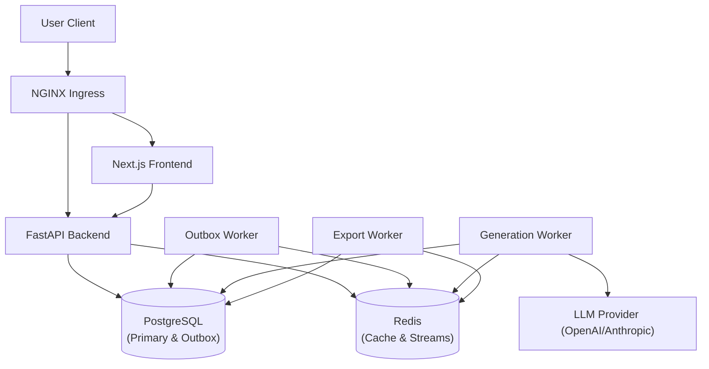
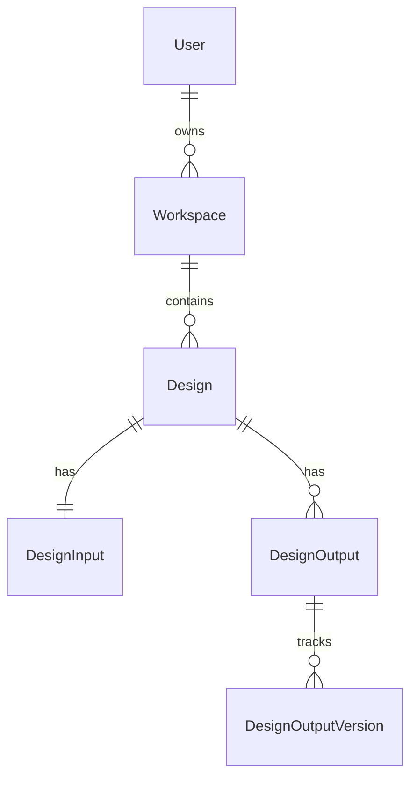
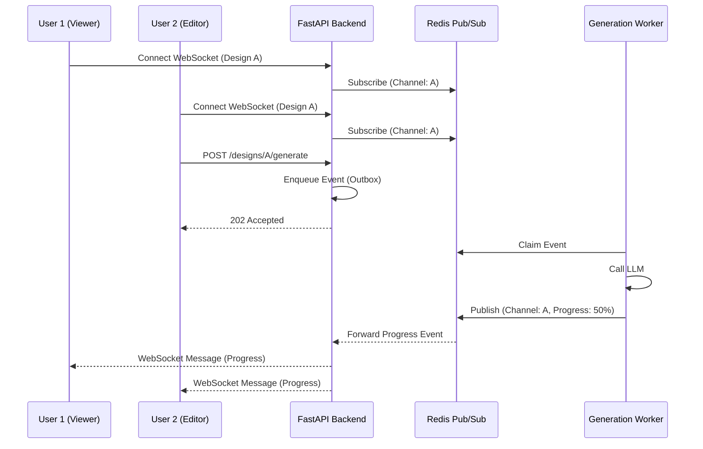

# Architecture Overview

SystemForge AI utilizes a modern, event-driven microservices architecture designed to handle long-running, asynchronous LLM operations reliably without blocking the user interface.

## System Topology

1. **Frontend (Next.js 15)**
   - Deployed on Vercel or a Node.js runtime.
   - Handles the React UI, client-side state, and communicates with the Backend via REST and WebSockets.

2. **Backend (FastAPI)**
   - The primary API gateway and business logic orchestrator.
   - Handles authentication, RBAC, and synchronous validation.

3. **Data Layer (PostgreSQL & Redis)**
   - **PostgreSQL**: The source of truth. Stores users, workspaces, and the massive JSON configurations of generated architectures.
   - **Redis**: Serves a dual purpose: caching layer and the underlying pub/sub mechanism for asynchronous streams.

## Event-Driven Asynchrony (Transactional Outbox)

To ensure high reliability when delegating tasks to workers (e.g., calling OpenAI), we use the **Transactional Outbox Pattern**:

1. A user requests a new architecture.
2. The FastAPI backend opens a PostgreSQL transaction.
3. It inserts the new "Pending Design" record into the `designs` table.
4. Within the *same transaction*, it inserts a "Generation Requested" event into the `outbox_events` table.
5. The transaction commits.
6. The **Outbox Relay Worker** polls the `outbox_events` table and pushes the event into a Redis Stream.
7. The **Generation Worker** pulls the event from the Redis Stream, processes the LLM call, and updates the database.

*Benefit*: We never encounter a state where the database record is created but the worker message is lost due to a network blip.

### Database Schema Overview

## Worker Ecosystem

The system delegates heavy processing to isolated workers, allowing independent scaling:

- **Generation Worker**: Handles the heavy interaction with LLMs (OpenAI/Anthropic).
- **Export Worker**: Processes requests to convert JSON architectures into Terraform or PDF files.
- **Notification Worker**: Dispatches emails or Slack alerts.
- **Delivery Worker**: Manages the finalization of states and webhook deliveries to external systems.

## Real-Time Collaboration (WebSockets)

When multiple users view the same architecture dashboard, they require real-time updates:

- Clients establish a WebSocket connection to the FastAPI backend.
- The backend subscribes to a Redis Pub/Sub channel specific to that design artifact.
- When any user makes a mutation (or when a worker completes a generation), an event is broadcast over Redis.
- All connected FastAPI nodes receive the broadcast and push it down their active WebSockets to the clients.

