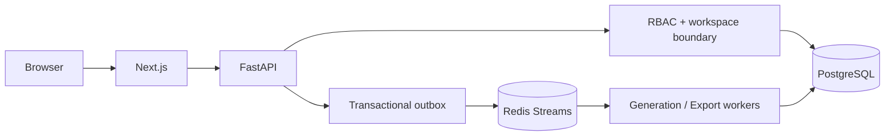

# Multi-tenant SaaS Control Plane

## Decision summary

- PostgreSQL is the durable source of truth.
- Every tenant-owned row carries a `workspace_id`.
- Authorization is checked at both the route and query boundary.
- Redis Streams carries generation and export jobs.
- A transactional outbox prevents database/event drift.
- Architecture artifacts move through `draft → in_review → approved`.

## Runtime topology

## Acceptance checks

- A user cannot read or mutate a design from another workspace.
- Retried jobs do not create duplicate artifacts.
- Every approval transition records actor and timestamp.
- Export failures are observable and retryable.
